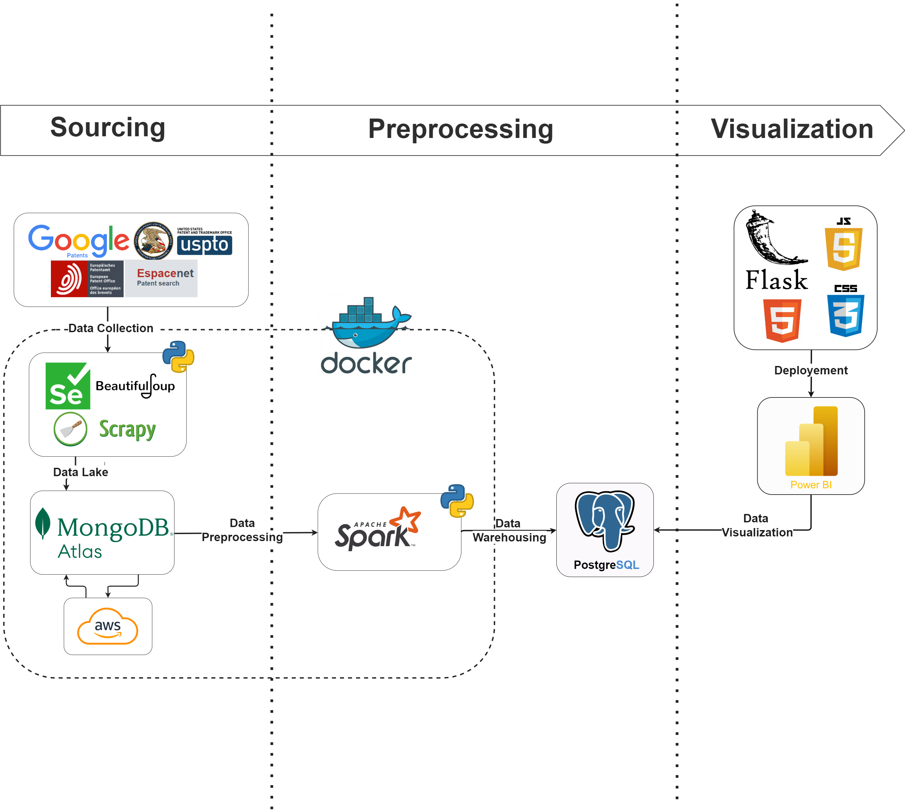

# Patent Analysis Project

## Overview

### Architecture

I'm thrilled to share details about our latest big data project, conducted in collaboration with my colleagues: **Housni Achbouq**, **Mohamed Afkir**, **Mohamed Rida Ben Touhami**, and **Oussama BENABBOU**. Together, we leveraged cutting-edge technologies to perform comprehensive patent analysis for the agriculture domain. 

Our solution integrates **PySpark** for data processing, **MongoDB** as a document database, **PostgreSQL** as a data warehouse, and **Power BI** for visualization. This project aims to provide crucial insights into patent statistics, which are vital for investors to gauge scientific competencies and for researchers to identify trending fields.

### Why Patent Analysis Matters

Understanding patent statistics is crucial for both investors and researchers:
- **Investors**: Gain insights into scientific competencies.
- **Researchers**: Identify the most popular fields for groundbreaking research.

## Project Steps

1. **Data Collection**: 
   - Collected data from various sources such as USPTO, Google Patents, EPO, and CIPO.
   - **Challenge**: Different architectures and data formats from each source.

2. **Data Storage**: 
   - Utilized **MongoDB Atlas** as a document database to manage the diverse data sets.

3. **Data Transformation**: 
   - Leveraged **PySpark** to process and clean the data, ensuring consistency and accuracy.

4. **Data Warehousing**: 
   - Stored the transformed data in **PostgreSQL**, providing a robust data warehouse solution.

5. **Visualization**: 
   - Used **Power BI** to create dynamic dashboards, offering valuable insights at a glance.

6. **Web Integration**: 
   - Integrated our dashboards into a web interface for easy access and interaction using **Flask**, **JavaScript**, **CSS**, and **HTML** technologies.

## Key Takeaways 🔧

- The difference in data architecture across sources was a significant challenge but led to a comprehensive understanding of the data landscape.
- Using a combination of tools and technologies, we streamlined the process from data collection to visualization, ensuring high-quality insights.

## Connect and Collaborate

Feel free to connect and collaborate on [LinkedIn](https://www.linkedin.com/in/mohamed-afkir-1bbb9729a) 
or contact me via [email](mailto:mohamedafkir078@gmail.com)

